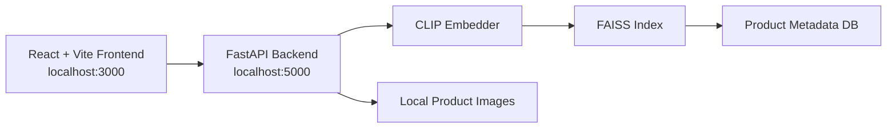

# Nova Vision-Language Product Search Engine

[](./LICENSE)


Nova is a local-first, multimodal product search engine that supports text, image, and hybrid retrieval over a prebuilt FashionIQ-backed catalog. The project ships with a React frontend, a FastAPI backend, a FAISS search index, and local product image serving so it can be cloned and run as a complete end-to-end system.

## Table of Contents

- [Overview](#overview)
- [Key Features](#key-features)
- [Architecture](#architecture)
- [Quick Start](#quick-start)
- [Detailed Setup](#detailed-setup)
- [How To Use](#how-to-use)
- [API Endpoints](#api-endpoints)
- [Configuration](#configuration)
- [Tech Stack](#tech-stack)
- [Project Structure](#project-structure)
- [Data Assets](#data-assets)
- [Validation](#validation)
- [Troubleshooting](#troubleshooting)
- [License](#license)

## Overview

This repository contains a full local web application for cross-modal product retrieval:

- Search products with natural language
- Search by uploading a reference image
- Blend text and image into a hybrid query
- Serve real product images from the local dataset
- Inspect and test the backend through FastAPI docs

The repository includes the application source code and the local search assets needed to run the system, including the prebuilt FAISS index and product metadata.

## Key Features

- Text search powered by CLIP text embeddings
- Image search powered by CLIP image embeddings
- Hybrid search with adjustable text-image fusion
- Fast nearest-neighbor retrieval using FAISS
- FastAPI backend with `/health`, `/metrics`, and interactive `/docs`
- React + Vite frontend with a polished local search UI
- Local dataset image serving from the backend
- Windows-friendly development workflow with `npm.cmd`

## Architecture



Search flow:

1. The frontend sends a text, image, or hybrid query to the FastAPI backend.
2. The backend encodes the query with CLIP.
3. FAISS retrieves the nearest candidate products.
4. Metadata and image paths are resolved locally.
5. Results are returned to the frontend for browsing and refinement.

## Quick Start

For Windows PowerShell, use this exact flow:

```powershell
git lfs install
git clone https://github.com/double-u9/Nova-Vision-Language-Product-Search-Engine.git
cd Nova-Vision-Language-Product-Search-Engine
npm.cmd install
npm.cmd run setup:python
npm.cmd run dev
```

Then open:

- Frontend UI: `http://127.0.0.1:3000`
- Backend health: `http://127.0.0.1:5000/health`
- Backend docs: `http://127.0.0.1:5000/docs`

Why `npm.cmd`:

- PowerShell may block `npm.ps1` because of execution policy
- `npm.cmd` avoids that issue and works reliably on Windows

## Detailed Setup

### Requirements

- Node.js 20 or newer
- Python 3.11 or 3.12
- Git
- Git LFS

### Windows Setup

```powershell
git lfs install
git clone https://github.com/double-u9/Nova-Vision-Language-Product-Search-Engine.git
cd Nova-Vision-Language-Product-Search-Engine
npm.cmd install
npm.cmd run setup:python
npm.cmd run dev
```

### macOS / Linux Setup

```bash
git lfs install
git clone https://github.com/double-u9/Nova-Vision-Language-Product-Search-Engine.git
cd Nova-Vision-Language-Product-Search-Engine
npm install
npm run setup:python
npm run dev
```

### Production-Style Local Run

Windows PowerShell:

```powershell
npm.cmd start
```

macOS / Linux:

```bash
npm start
```

### First Startup Notes

The first run can take a while because the project may:

- Create the Python virtual environment
- Install backend Python dependencies
- Download CLIP model weights
- Load the FAISS index into memory

## How To Use

After the app starts:

1. Open `http://127.0.0.1:3000`
2. Enter a text query, upload an image, or use both
3. Review the returned products and scores
4. Use the backend docs at `http://127.0.0.1:5000/docs` to test the API directly

## API Endpoints

| Method | Endpoint | Purpose |
|---|---|---|
| `GET` | `/health` | Backend health and startup state |
| `GET` | `/metrics` | Simple request and latency metrics |
| `POST` | `/search/text` | Text-only product search |
| `POST` | `/search/image` | Image-only product search |
| `POST` | `/search/hybrid` | Combined text + image search |

Important note:

- `http://127.0.0.1:5000/` returning `{"detail":"Not Found"}` is expected because the backend does not define a root `/` route

## Configuration

The project supports local overrides through `.env`. A template is included in [.env.example](./.env.example).

| Variable | Default | Description |
|---|---|---|
| `FRONTEND_HOST` | `127.0.0.1` | Frontend bind host |
| `FRONTEND_PORT` | `3000` | Frontend port |
| `BACKEND_HOST` | `127.0.0.1` | Backend bind host |
| `BACKEND_PORT` | `5000` | Backend port |
| `VITE_API_BASE_URL` | `http://127.0.0.1:5000` | Frontend API base URL |
| `NOVA_CORS_ORIGINS` | `http://localhost:3000,http://127.0.0.1:3000` | Allowed local frontend origins |
| `NOVA_PYTHON` | unset | Pin a specific Python executable |
| `NOVA_BACKEND_RELOAD` | unset | Enable backend auto-reload in dev mode |

## Tech Stack

- Frontend: React 19, Vite, TypeScript, Radix UI, TanStack Query
- Backend: FastAPI, Uvicorn, Python
- Retrieval: OpenAI CLIP, FAISS
- Data: SQLite metadata, local image dataset, prebuilt FAISS index
- Tooling: npm scripts, Git LFS

## Project Structure

```text
.
|- attached_assets/      Supporting design/reference assets
|- nova/                 Backend code, data assets, index, metadata
|- public/               Static frontend assets
|- scripts/              Local setup and run helpers
|- src/                  React frontend source
|- .env.example          Environment template
|- .gitattributes        Git LFS tracking rules
|- .gitignore            Ignore rules for local/runtime artifacts
|- LICENSE
|- README.md
|- index.html
|- package.json
|- requirements.txt
|- tsconfig.json
`- vite.config.ts
```

## Data Assets

This repository includes a full local runtime dataset:

- `nova/data/fashionIQ_dataset/images/` for product images
- `nova/data/products.db` for product metadata
- `nova/data/faiss.index` for the prebuilt FAISS retrieval index

Git LFS is required for the FAISS index:

```bash
git lfs install
```

If you clone without Git LFS, the FAISS index may be downloaded as a pointer file instead of the real asset.

## Validation

The project was validated locally with:

```powershell
npm.cmd run setup:python
npm.cmd run build
```

Successful validation confirms:

- Python dependencies install cleanly
- TypeScript compilation passes
- The Vite production build completes successfully

## Troubleshooting

### PowerShell blocks `npm`

If PowerShell complains about `npm.ps1`, use:

```powershell
npm.cmd install
npm.cmd run dev
```

### Backend root shows `{"detail":"Not Found"}`

That is normal. Use:

- `http://127.0.0.1:5000/health`
- `http://127.0.0.1:5000/docs`

### First run is slow

That is also normal on a fresh machine because the project sets up Python dependencies, CLIP weights, and the index runtime.

### Clone is incomplete

Make sure Git LFS is installed and enabled before cloning:

```bash
git lfs install
```

### Python is not detected

Create a `.env` file and set:

```env
NOVA_PYTHON=C:\Path\To\python.exe
```

## License

This project is licensed under the [MIT License](./LICENSE).
