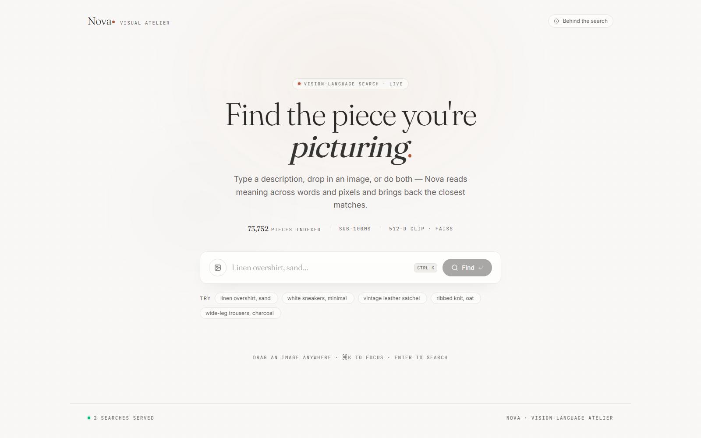
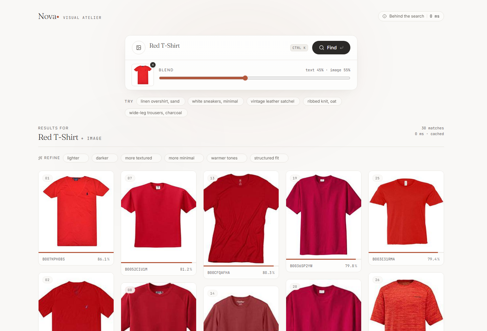
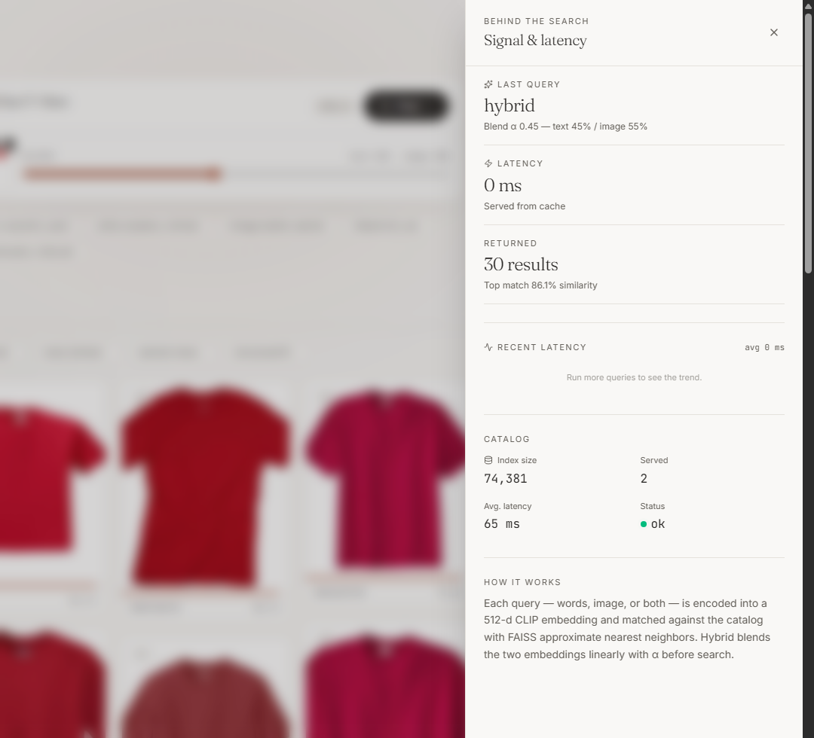
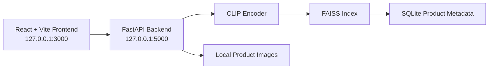

# Nova Vision-Language Product Search Engine

[](./LICENSE)


Nova is a local-first multimodal product search application built around CLIP and FAISS. It supports text search, image search, hybrid text-plus-image retrieval, and local catalog browsing over a prebuilt FashionIQ-backed dataset.

The repository includes the frontend, backend, local image assets, metadata database, and the FAISS index required to run the full experience on localhost.

## Table of Contents

- [Overview](#overview)
- [Product Tour](#product-tour)
- [Key Features](#key-features)
- [Architecture](#architecture)
- [Quick Start](#quick-start)
- [Fresh Windows Setup](#fresh-windows-setup)
- [Run URLs](#run-urls)
- [Detailed Setup](#detailed-setup)
- [API Endpoints](#api-endpoints)
- [Configuration](#configuration)
- [Project Structure](#project-structure)
- [Data Assets](#data-assets)
- [Validation](#validation)
- [Troubleshooting](#troubleshooting)
- [License](#license)

## Overview

Nova is designed as a complete local search system:

- Search products with natural language
- Search from a reference image
- Blend text and image into a hybrid query
- Inspect latency, catalog status, and recent search health
- Run everything locally with a React frontend and FastAPI backend

## Product Tour

### Landing Experience

<p align="center">
  
</p>
<p align="center"><em>Editorial landing page with text, image, and hybrid search entry points.</em></p>

### Hybrid Retrieval

<p align="center">
  
</p>
<p align="center"><em>Hybrid retrieval combines a text prompt with an uploaded reference image to surface visually aligned matches.</em></p>

### Behind The Search

<p align="center">
  
</p>
<p align="center"><em>The insight drawer exposes query mode, latency, result count, and live catalog health.</em></p>

## Key Features

- CLIP-powered text retrieval
- CLIP-powered image retrieval
- Hybrid fusion with adjustable text/image weighting
- Fast nearest-neighbor search using FAISS
- "More like this" visual similarity retrieval
- Toggleable and removable refinement chips
- FastAPI backend with `/health`, `/metrics`, and `/docs`
- Local image serving from the dataset
- Windows-friendly startup flow for both Command Prompt and PowerShell

## Architecture



Search flow:

1. The frontend sends a text, image, hybrid, or similar-item query to the backend.
2. The backend encodes the request with CLIP.
3. FAISS retrieves the nearest candidate products.
4. Product metadata and local image paths are resolved.
5. Results are returned to the frontend for browsing and refinement.

## Quick Start

### Windows Command Prompt

Use this when you are running inside `cmd.exe`.

```cmd
git lfs install
git clone https://github.com/double-u9/Nova-Vision-Language-Product-Search-Engine.git
cd Nova-Vision-Language-Product-Search-Engine
node -v
npm -v
npm install
npm run setup:python
npm run dev
```

### Windows PowerShell

Use this when PowerShell blocks `npm.ps1` or when you want the safest Windows path.

```powershell
git lfs install
git clone https://github.com/double-u9/Nova-Vision-Language-Product-Search-Engine.git
cd Nova-Vision-Language-Product-Search-Engine
node -v
npm -v
npm.cmd install
npm.cmd run setup:python
npm.cmd run dev
```

### macOS / Linux

```bash
git lfs install
git clone https://github.com/double-u9/Nova-Vision-Language-Product-Search-Engine.git
cd Nova-Vision-Language-Product-Search-Engine
npm install
npm run setup:python
npm run dev
```

## Fresh Windows Setup

If this is your first time running the project on a Windows machine:

1. Install Git and Git LFS.
2. Install Python 3.11 or 3.12.
3. Install Node.js LTS and make sure `npm` is included.
4. Open a brand-new terminal after installation.
5. Verify your tools before running the project:

```cmd
node -v
npm -v
py --version
git lfs version
```

6. Enter the repository root and confirm `package.json` exists:

```cmd
cd Nova-Vision-Language-Product-Search-Engine
dir package.json
```

If `package.json` is not found, you are in the wrong folder.

## Run URLs

Once `npm run dev` or `npm.cmd run dev` is running:

- Frontend UI: `http://127.0.0.1:3000`
- Backend health: `http://127.0.0.1:5000/health`
- Backend docs: `http://127.0.0.1:5000/docs`

## Detailed Setup

### Requirements

- Node.js 20 or newer
- Python 3.11 or 3.12
- Git
- Git LFS

### Production-Style Local Run

Windows Command Prompt:

```cmd
npm start
```

Windows PowerShell:

```powershell
npm.cmd start
```

macOS / Linux:

```bash
npm start
```

### First Startup Notes

The first run may take a while because Nova may:

- Create a Python virtual environment
- Install backend Python dependencies
- Download CLIP model weights
- Load the FAISS index into memory

## API Endpoints

| Method | Endpoint | Purpose |
|---|---|---|
| `GET` | `/health` | Backend health and startup status |
| `GET` | `/metrics` | Request and latency metrics |
| `POST` | `/search/text` | Text-only search |
| `POST` | `/search/image` | Image-only search |
| `POST` | `/search/hybrid` | Text + image hybrid search |
| `POST` | `/search/similar` | Similar-item retrieval from a product ID |

Important note:

- `http://127.0.0.1:5000/` returning `{"detail":"Not Found"}` is expected because the backend does not define a root `/` route.

## Configuration

The project supports local overrides through `.env`. A template is included in [.env.example](./.env.example).

| Variable | Default | Description |
|---|---|---|
| `FRONTEND_HOST` | `127.0.0.1` | Frontend bind host |
| `FRONTEND_PORT` | `3000` | Frontend port |
| `BACKEND_HOST` | `127.0.0.1` | Backend bind host |
| `BACKEND_PORT` | `5000` | Backend port |
| `VITE_API_BASE_URL` | `http://127.0.0.1:5000` | Frontend API base URL |
| `NOVA_CORS_ORIGINS` | `http://localhost:3000,http://127.0.0.1:3000` | Allowed frontend origins |
| `NOVA_PYTHON` | unset | Pin a specific Python executable |
| `NOVA_BACKEND_RELOAD` | unset | Enable backend auto-reload in dev mode |

## Project Structure

```text
.
|- attached_assets/      Supporting design/reference assets
|- docs/screenshots/     README product screenshots
|- nova/                 Backend code, data assets, index, metadata
|- public/               Static frontend assets
|- scripts/              Local setup, run, and maintenance helpers
|- src/                  React frontend source
|- .env.example          Environment template
|- .gitattributes        Git LFS tracking rules
|- .gitignore            Ignore rules for local/runtime artifacts
|- LICENSE
|- README.md
|- index.html
|- package.json
|- requirements.txt
|- tsconfig.json
`- vite.config.ts
```

## Data Assets

This repository ships with a complete local retrieval bundle:

- `nova/data/fashionIQ_dataset/images/` for product images
- `nova/data/products.db` for product metadata
- `nova/data/faiss.index` for the prebuilt FAISS search index

Git LFS is required for the FAISS index:

```bash
git lfs install
```

If Git LFS is missing, `faiss.index` may clone as a pointer file instead of the real binary.

## Validation

The project has been validated locally with:

Windows PowerShell:

```powershell
npm.cmd run setup:python
npm.cmd run build
```

Command Prompt / macOS / Linux:

```bash
npm run setup:python
npm run build
```

Successful validation confirms:

- Python dependencies install cleanly
- TypeScript compilation passes
- The Vite production build completes successfully
- The backend can boot with the local FAISS index and metadata

## Troubleshooting

### `npm` is not recognized

Node.js is either not installed correctly or not on `PATH`.

What to do:

1. Reinstall Node.js LTS
2. Make sure `npm` is included
3. Reopen the terminal
4. Run:

```cmd
node -v
npm -v
```

### `npm.ps1 cannot be loaded` in PowerShell

Use `npm.cmd` instead:

```powershell
npm.cmd install
npm.cmd run setup:python
npm.cmd run dev
```

### `Could not read package.json`

You are not inside the repository root.

Fix:

```cmd
cd Nova-Vision-Language-Product-Search-Engine
dir package.json
```

### `Missing script: "dev...activate"`

Two commands were pasted on the same line.

Use separate commands only:

```cmd
npm run setup:python
npm run dev
```

Do not append `.venv\Scripts\activate` to the same `npm run dev` line.

### Do I need `py -m npm`?

No.

`npm` belongs to Node.js, not Python. Use:

```cmd
npm install
```

### Backend root shows `{"detail":"Not Found"}`

That is normal. Use:

- `http://127.0.0.1:5000/health`
- `http://127.0.0.1:5000/docs`

### First run is slow

That is expected on a fresh machine because Nova is setting up Python packages, loading CLIP, and warming the index.

## License

This project is licensed under the [MIT License](./LICENSE).
